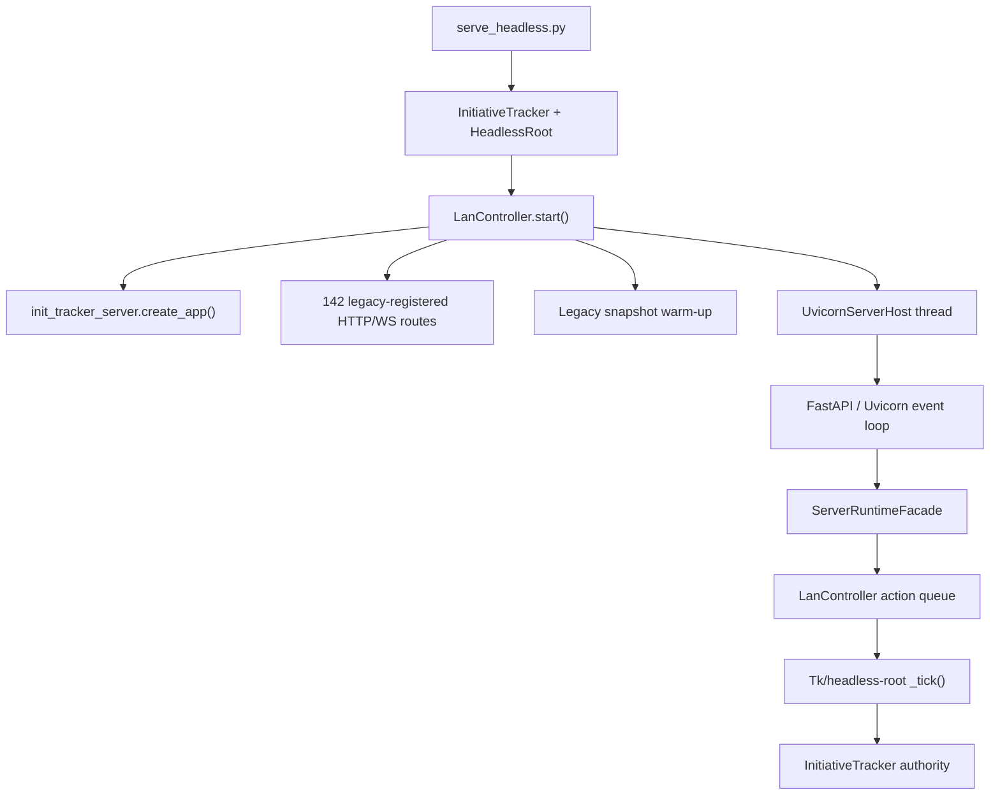
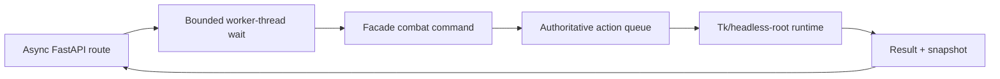

# Init Tracker Updated Migration Assessment

**Assessment date:** 2026-07-09  
**Repository inspected:** `jeeves-jeevesenson/init-tracker`  
**Branch/ref:** GitHub default branch `main` at [`1370ac72`](https://github.com/jeeves-jeevesenson/init-tracker/commit/1370ac72e63544c6365eebdf839a1556a3178e48)  
**Compared baselines:** `deep-research-report (2).md`, `deep-research-report (1).md`, and `deep-research-report.md`

## Executive conclusion

The migration is materially farther along than any of the attached reports describe. The repository has completed every immediate next step recommended by the June 30 baseline report and the July 1 direction review:

- package-internal runtime import realignment;
- a working `read_snapshot()` façade boundary;
- first production read adoption;
- mode-aware DM-console cache refinement;
- route-local threadpool offload for DM combat reads;
- a package-owned Uvicorn host boundary;
- live host-boundary smoke evidence and deploy guidance;
- targeted snapshot/LAN profiling and two resource-pool hot-path refinements;
- a combat read-model composition optimization;
- route/request overlap instrumentation that identified event-loop starvation from synchronous write/broadcast work.

The repo is therefore no longer at the “create a package and define a façade” stage. It is in a transitional containment stage: the ASGI layer is protected from one major read hotspot, selected mutations use an explicit queue boundary, and the dominant read-model costs have been measured and reduced.

However, the full architectural inversion described in the external research has **not** happened. The present design remains a legacy tracker runtime that constructs a headless Tk-compatible authority, registers almost the entire FastAPI surface from `LanController.start()`, runs the authoritative action loop on the Tk/headless-root thread, and hosts Uvicorn in a package-owned background thread. The package owns server mechanics; it does not yet own runtime construction, route ownership, WebSocket session ownership, or the authoritative command lifecycle.

The most important current finding is no longer “reads block health checks.” That problem was successfully contained. The current evidence points to **synchronous write and broadcast work executing on the ASGI event loop**. In the slowest correlated sample, a concurrent `POST /api/dm/combat/start` spent about 1.3 seconds in synchronous broadcast work and delayed an otherwise-completed GET coroutine from resuming. That is the next architectural pressure point, subject to the controlled-repeat evidence gate already selected in the current work ledger.

My overall assessment is:

- **Tactical extraction progress:** strong and evidence-driven.
- **ASGI/runtime ownership inversion:** approximately 40–45% complete.
- **Web-first product migration overall:** farther along than the server inversion, but still held back by legacy runtime ownership and monolithic registration/dispatch surfaces.
- **Immediate next action:** execute the already-selected controlled-repeat evidence pass; do not add another read optimization first.
- **Likely next implementation lane if the evidence reproduces the problem:** move one coherent combat mutation family through the existing authoritative queue while keeping synchronous HTTP compatibility and offloading the bounded wait from the event loop.

## Scope and evidence hierarchy

This report treats sources in the following order:

1. Current code on GitHub `main` at `1370ac72`.
2. [`docs/work_items/current_work.md`](https://github.com/jeeves-jeevesenson/init-tracker/blob/1370ac72e63544c6365eebdf839a1556a3178e48/docs/work_items/current_work.md), which is the repo's active-work authority.
3. Current living architecture, planning, completed-work, smoke, and runtime-evidence documents.
4. The three attached reports as historical baselines and design benchmarks.

This is a read-only assessment of GitHub `main`. It does not include unpublished local commits or uncommitted work on another machine.

## What each attached report represented

### `deep-research-report (2).md`: target architecture and generic extraction plan

This report defined the ideal staged destination:

- ASGI owns process lifecycle, HTTP, WebSockets, sessions, and subscriptions;
- the runtime becomes a narrow service behind commands, snapshots, and events;
- reads come from versioned snapshots;
- writes are accepted quickly and complete asynchronously;
- blocking containment uses thread/process offload during transition;
- command IDs, status endpoints, transport flags, load testing, metrics, rollback, and eventual worker isolation follow.

It remains strategically sound, but its illustrative six-week schedule was much more aggressive than the compatibility and evidence constraints of this repository. The repo has implemented parts of its foundation and boundary phases, but not the full accepted-command, event-bus, worker-isolation, or cutover phases.

### `deep-research-report (1).md`: June 30 migration baseline

This report represented the repository around the package runtime re-export boundary, approximately commit [`953d13dd`](https://github.com/jeeves-jeevesenson/init-tracker/commit/953d13dd). It correctly identified these then-current gaps:

- `init_tracker_server.app` was not yet importing through the package runtime boundary;
- `read_snapshot()` was fail-closed;
- snapshot reads still bypassed the façade;
- async handlers still invoked synchronous runtime work;
- request-side queue waiting used bounded polling;
- host and snapshot ownership remained legacy-shaped.

There are **50 commits after that baseline** in the current 100-commit GitHub history. Its entire prioritized next-task sequence was completed.

### `deep-research-report.md`: July 1 direction review

This report represented the repo after DM-console read offload, approximately commit [`40c40656`](https://github.com/jeeves-jeevesenson/init-tracker/commit/40c406562f47487a6bc47633964a2f98e19beb14), and recommended app-host/runtime lifecycle realignment next. There are **32 commits after that code point**.

Its central recommendation was followed, but with a narrower implementation than the phrase “server ownership” might imply. The repo extracted Uvicorn configuration, event-loop creation, thread creation, server execution, and stop requests into `init_tracker_server.host.UvicornServerHost`. It deliberately left app construction calls, nearly all route registration, route bodies, initial snapshot warm-up, Tk polling, runtime authority, and launch semantics in legacy ownership.

## Current architecture at a glance

This is a real improvement over the original script-hosted shape, but it is not yet the target architecture from the research. The important ownership distinction is:

| Concern | Current owner | Target owner |
| --- | --- | --- |
| FastAPI factory, health/readiness | `init_tracker_server.app` | ASGI package |
| Uvicorn config/server/thread/stop request | `init_tracker_server.host` | ASGI/process host |
| Runtime object construction | `serve_headless.py` / `InitiativeTracker()` | ASGI lifespan or explicit runtime service host |
| Non-health route registration | `LanController.start()` | Package routers/registrars |
| Route bodies | Nested closures in `dnd_initative_tracker.py` | Thin package routes calling service contracts |
| Snapshot warm-up | `LanController.start()` | Runtime/snapshot service lifecycle |
| Authoritative action execution | Tk/headless-root `_tick()` and direct legacy service calls | Runtime worker/service |
| WebSocket registry and fanout | `LanController` | ASGI session/subscription layer |
| Command state | Internal `_action_states` polling | Public command lifecycle/status/event contract |

## Quantitative shape of the remaining legacy boundary

Current code size is not itself a defect, but the concentration of ownership is useful evidence:

| Surface | Current size/shape | Architectural meaning |
| --- | ---: | --- |
| `dnd_initative_tracker.py` | 52,815 lines; about 2.53 MB | Still the dominant integration/runtime host. |
| `LanController` | About 8,021 lines | Owns server integration, clients, caches, and route-related state. |
| `LanController.start()` | About 4,713 lines | Registers 140 HTTP routes and 2 WebSocket routes, mounts static paths, defines helpers, warms snapshots, starts the server host, and starts polling. |
| `_lan_apply_action()` | About 538 lines; 38 direct `typ` branches | Still a large command convergence/dispatch hotspot despite service extraction around it. |
| `server_runtime.py` | 1,065 lines | Contains explicit contracts and real read/write seams, but also a long branch dispatcher and synchronous queue polling. |
| `combat_service.py` | 1,993 lines | A useful domain service seam; now includes a measured per-call composition optimization. |
| `player_command_service.py` | 7,713 lines | Authority has moved out of the monolith in meaningful areas, but the extracted service is itself very large. |
| `player_command_contracts.py` | 1,825 lines | Explicit contracts exist for a large player-command surface. |
| `tests/test_server_runtime.py` | 4,649 lines; 86 tests | The extraction has unusually strong focused regression coverage for its current stage. |

The main structural conclusion is that the migration has created seams around the monolith, but has not yet reduced the central route-registration and runtime-authority concentrations enough to call the server/runtime split complete.

## Changes completed since the June 30 baseline

### 1. Package runtime boundary was made real for the app factory

`init_tracker_server/app.py` now imports `ServerRuntimeFacade` through `.runtime`, while `init_tracker_server/runtime.py` remains a compatibility re-export from root `server_runtime.py`. `server_app.py` is a small compatibility shim.

This closes the first recommendation from `deep-research-report (1).md`.

Evidence:

- [`init_tracker_server/app.py`](https://github.com/jeeves-jeevesenson/init-tracker/blob/1370ac72e63544c6365eebdf839a1556a3178e48/init_tracker_server/app.py)
- [`init_tracker_server/runtime.py`](https://github.com/jeeves-jeevesenson/init-tracker/blob/1370ac72e63544c6365eebdf839a1556a3178e48/init_tracker_server/runtime.py)
- [`server_app.py`](https://github.com/jeeves-jeevesenson/init-tracker/blob/1370ac72e63544c6365eebdf839a1556a3178e48/server_app.py)

### 2. Snapshot boundary was implemented and adopted

`ServerRuntimeFacade.read_snapshot()` now supports explicit `combat`, `tactical`, and `dm_console` snapshot contracts. It validates snapshot type and parameters, rejects unsupported static hydration, requires explicit tactical/workspace intent, maps builder failures to structured errors, and records the source in metadata.

`GET /api/dm/combat` now constructs `RuntimeSnapshotRequest(snapshot_type="dm_console", ...)` and reads through the façade.

Important limitation: the façade is still an adapter over legacy builders:

- combat reads call `CombatService.combat_snapshot()`;
- tactical reads call `tracker._dm_tactical_snapshot()`;
- DM-console reads call `LanController._dm_console_snapshot()`.

The boundary is real at the contract level, but snapshot ownership and cache ownership have not moved into the package/runtime service.

Evidence:

- [`server_runtime.py`](https://github.com/jeeves-jeevesenson/init-tracker/blob/1370ac72e63544c6365eebdf839a1556a3178e48/server_runtime.py)
- [`dnd_initative_tracker.py`](https://github.com/jeeves-jeevesenson/init-tracker/blob/1370ac72e63544c6365eebdf839a1556a3178e48/dnd_initative_tracker.py)

### 3. Read-side event-loop containment succeeded

Commit [`40c40656`](https://github.com/jeeves-jeevesenson/init-tracker/commit/40c406562f47487a6bc47633964a2f98e19beb14) moved DM-console façade reads to a threadpool and serialized tactical workspace reads locally.

Before offload, health, readiness, plain combat, and tactical combat probes all spiked together around 890–899 ms p95. After the bounded offload:

| Endpoint | Post-offload p95 | Post-offload max |
| --- | ---: | ---: |
| `/health` | 27.914 ms | 43.049 ms |
| `/api/health` | 27.878 ms | 42.897 ms |
| `/ready` | 28.769 ms | 43.147 ms |
| `/api/ready` | 28.494 ms | 42.996 ms |
| `/api/dm/combat` | 30.410 ms | 45.908 ms |
| `/api/dm/combat?workspace=dmcontrol` | 790.840 ms | 1,092.869 ms |

This met the external research's suggested p95 health-under-load target of less than 50 ms for the bounded test profile. It did not make tactical snapshots cheap; it stopped them from stalling unrelated lightweight endpoints.

Evidence: [`server_runtime_post_offload_responsiveness_checkpoint_20260701.md`](https://github.com/jeeves-jeevesenson/init-tracker/blob/1370ac72e63544c6365eebdf839a1556a3178e48/docs/planning/living_docs/server_runtime_post_offload_responsiveness_checkpoint_20260701.md).

### 4. Package-owned Uvicorn mechanics were extracted

Commit [`14932cb4`](https://github.com/jeeves-jeevesenson/init-tracker/commit/14932cb4e75ae3cd6763de731ee0e317e4237104) added `UvicornServerHost` and moved these mechanics out of inline `LanController.start()` code:

- server-thread event-loop creation and binding;
- `uvicorn.Config` and `uvicorn.Server` construction;
- daemon thread creation/start;
- `server.serve()` execution;
- canonical `should_exit` stop request.

Live smoke later proved startup, `/`, `/dm`, representative combat routes, WebSocket claim/reconnect behavior, and shutdown logging. Deploy guidance was approved, though actual deployment remains developer-authorized only.

This is an important but deliberately narrow milestone. `UvicornServerHost` accepts an already-created, already-registered app. It does not create the runtime, register routes, warm snapshots, own Tk polling, join the thread, cancel tasks, or own gameplay authority.

Evidence:

- [`init_tracker_server/host.py`](https://github.com/jeeves-jeevesenson/init-tracker/blob/1370ac72e63544c6365eebdf839a1556a3178e48/init_tracker_server/host.py)
- [`WORK-20260701-app-host-runtime-lifecycle-minimal-implementation.md`](https://github.com/jeeves-jeevesenson/init-tracker/blob/1370ac72e63544c6365eebdf839a1556a3178e48/docs/work_items/completed/WORK-20260701-app-host-runtime-lifecycle-minimal-implementation.md)
- [`server_runtime_app_host_lifecycle_deploy_guidance_checkpoint_20260701.md`](https://github.com/jeeves-jeevesenson/init-tracker/blob/1370ac72e63544c6365eebdf839a1556a3178e48/docs/planning/living_docs/server_runtime_app_host_lifecycle_deploy_guidance_checkpoint_20260701.md)

### 5. Snapshot/LAN hot paths were measured and narrowed

The controlled July 1 trace proved the snapshot problem was real and repeatable:

- `_lan_snapshot` p95 1,220.955 ms, maximum 24.7 s;
- `_dm_tactical_snapshot` p95 2,313.119 ms;
- `_dm_console_snapshot` p95 2,376.749 ms;
- `/api/dm/combat` p95 2,858.221 ms in that heavy profile.

The repo did not jump directly into a broad cache rewrite. It added sub-span instrumentation, isolated `lan.snapshot.resource_pools`, added a payload cache, and then reused base normalization during TTL rebuilds.

The accepted TTL-rebuild refinement reduced `lan.snapshot.resource_pools`:

- p95 from 759.372 ms to 137.346 ms;
- maximum from 2,836.852 ms to 1,006.718 ms;
- samples at or above 250 ms from 83 to 4.

That result held under a heavier 212-combatant/202-monster trace, and the resource-pools lane was correctly closed instead of endlessly polished.

Evidence:

- [`snapshot_lan_hot_path_controlled_evidence_checkpoint_20260701.md`](https://github.com/jeeves-jeevesenson/init-tracker/blob/1370ac72e63544c6365eebdf839a1556a3178e48/docs/planning/living_docs/snapshot_lan_hot_path_controlled_evidence_checkpoint_20260701.md)
- [`95bbdf61`](https://github.com/jeeves-jeevesenson/init-tracker/commit/95bbdf6115f023e6bf5fdf7d61ac244e73e60b84)
- [`d16a2aa5`](https://github.com/jeeves-jeevesenson/init-tracker/commit/d16a2aa5c9aef832f5dfec5bfa7a13f79841f5b0)
- [`snapshot_lan_resource_pools_ttl_rebuild_smoke_evidence_capture_20260702.md`](https://github.com/jeeves-jeevesenson/init-tracker/blob/1370ac72e63544c6365eebdf839a1556a3178e48/docs/planning/living_docs/snapshot_lan_resource_pools_ttl_rebuild_smoke_evidence_capture_20260702.md)

### 6. Combat read-model composition was optimized

Commit [`82b996ad`](https://github.com/jeeves-jeevesenson/init-tracker/commit/82b996adfc0bf99cf95dd3d56b135af10457d09d) added a transient per-call composition context to `CombatService.combat_snapshot()`:

- stages ordered combatant entries once;
- captures helper callables once;
- caches AC modifier, passive perception, and defense results per combatant;
- pre-indexes monster resource state by combatant instead of repeatedly filtering the full mapping.

Under a roughly 112-combatant/102-monster shape:

- `combat_service.combat_snapshot` p95 improved from 500.641 ms to 384.238 ms;
- `dm.console.combat_snapshot.service_call` p95 improved from 501.904 ms to 386.362 ms.

This is a good example of the repo's strongest current pattern: instrument, isolate, make a narrow behavior-preserving change, smoke it, and close the lane when the intended component improves.

### 7. Route/request overlap was attributed to write-side event-loop starvation

Commit [`a01c398d`](https://github.com/jeeves-jeevesenson/init-tracker/commit/a01c398d2ffa2f2c1acca78d83fa9e931dcf9310) added route response-build and threadpool scheduling spans.

The accepted follow-up found:

- `dm.console.route_response_build` maximum 0.429 ms: ruled out;
- `dm.console.threadpool_dispatch_queue` p50 0.350 ms, maximum 88.188 ms: watch item, not primary cause;
- the slow GET's internal snapshot completed, then waited about 715 ms before its coroutine resumed;
- a concurrent `POST /api/dm/combat/start` performed about 1,299.706 ms of synchronous `_lan_force_state_broadcast` work on the main ASGI event loop.

The current evidence therefore shifts the next performance question from read-model micro-optimization to write/request scheduling and event-loop ownership.

Evidence: [`dm_console_combat_route_request_overlap_planning_checkpoint_followup_20260708.md`](https://github.com/jeeves-jeevesenson/init-tracker/blob/1370ac72e63544c6365eebdf839a1556a3178e48/docs/planning/living_docs/dm_console_combat_route_request_overlap_planning_checkpoint_followup_20260708.md).

## Attached-report checklist versus current repo

| External-research checklist item | Current status | Assessment |
| --- | --- | --- |
| Create host package/app factory | **Partial-complete** | `init_tracker_server` exists; app factory, lifespan shell, health/readiness, runtime attachment, and Uvicorn mechanics exist. Runtime construction and route registration remain outside it. |
| Define a narrow façade | **Partial-complete** | Command and snapshot contracts exist and selected routes use them. Many routes and WebSocket flows still call legacy services/helpers directly. |
| Separate reads from writes | **Partial** | Explicit snapshot contracts exist. Selected static map writes use a queue. Reads are not universally cache-served and writes still return synchronously. |
| Add offload | **Partial** | DM-console reads are offloaded; tactical reads are serialized. Direct heavy writes/broadcasts can still block the event loop. No process offload exists. |
| Command IDs and public status | **Not complete** | Internal `action_id`/`_action_states` exist, but HTTP waits synchronously and there is no public accepted/status lifecycle. |
| ASGI owns WebSocket sessions | **Not complete** | FastAPI terminates WS routes, but `LanController` owns registries, claims, reconnect state, and fanout. |
| Instrument before optimizing | **Strong partial** | Custom JSONL spans and focused harnesses are extensive and useful. OTel/Prometheus dashboards, queue-age gauges, and standard load suites are absent. |
| Feature-flag transport | **Not started** | No legacy/threadpool/process/broker transport switch exists. |
| Worker process or broker | **Not started** | Authority remains in-process on the Tk/headless-root thread. |
| Canary/default-on cutover | **Not applicable yet** | There is no alternate runtime transport to cut over to. |

### Progress interpretation

The repository has completed much of the **foundation** and the first part of the **boundary** phase from the external plan. It has not entered true **runtime isolation** or **cutover**.

Calling this migration “mostly complete” would be misleading because the hardest ownership changes remain. Calling it “still at the beginning” would also be wrong because the repo now has tested contracts, measured offload, package host mechanics, live smoke evidence, and substantial route-command migration.

The most accurate description is: **the seams are proven; ownership inversion is incomplete**.

## What remains architecturally incomplete

### Runtime boot is not lifespan-owned

`serve_headless.py` sets the headless environment, imports the legacy module, constructs `InitiativeTracker()`, installs signal handling, and enters `app.mainloop()`. FastAPI lifespan only calls `ServerRuntimeFacade.start()`/`shutdown()`, which toggle readiness state. It does not create, start, warm, or stop the authoritative runtime.

This is the largest gap between the current implementation and the phrase “ASGI owns lifecycle.”

### Route registration is still legacy-owned

`LanController.start()` is a roughly 4,713-line composition root with 142 route decorators. It mixes:

- dependency imports and compatibility globals;
- middleware;
- static mounts;
- route-local helpers;
- HTTP and WebSocket handlers;
- authentication/session logic;
- snapshot access;
- queue-backed and direct mutations;
- initial snapshot seeding;
- server-host startup;
- Tk polling startup.

The repo already completed a route-registration planning checkpoint and correctly concluded that live smoke had to precede extraction. That smoke gap is now closed, but no registration extraction has been implemented.

### Direct write routes still bypass the authoritative queue

The original low-risk static tactical families remain queue-backed. High-risk or stateful families—including combat lifecycle/turn/HP mutations, rules-aware movement, AoE creation, structures, ships, and boarding—still contain direct service/helper calls.

The latest trace demonstrates why this is no longer only a cleanliness issue: a direct combat-start write and its synchronous broadcast can starve unrelated coroutines.

### Queue semantics are synchronous and request-shaped

`ServerRuntimeFacade._submit_to_lan_queue()`:

1. creates an internal action and trace ID;
2. stores pending state;
3. places a message on `LanController._actions`;
4. polls `_action_states` every 5 ms with `time.sleep()`;
5. returns or raises after completion/timeout.

This preserves compatibility and is acceptable when invoked from a worker thread, but it is not the accepted-command/status/event model from the research. It also lacks public idempotency, cancellation, reconnect, persistence, and result-retention contracts.

### WebSocket ownership is not extracted

WebSocket routes are registered on FastAPI, but the legacy controller owns connection dictionaries, locks, claims, restored claims, fanout, and state broadcasts. Runtime events are not published to a host-owned bus. This makes a process boundary premature until event ownership is designed.

### Snapshot versioning and cache ownership remain mixed

The repo has several useful cache/version mechanisms, including static snapshot caches, DM snapshot reuse, invalidation domains, and `_lan_combat_snapshot_version`. But there is not yet one package-owned, versioned read model that routes consume independently of legacy builders.

The current snapshot façade standardizes access. It does not yet standardize ownership.

### Operational metrics remain custom and offline

The trace/harness work is excellent for focused diagnosis, but the external success rubric expected continuously visible request duration, queue depth, command age, snapshot age, worker busy time, event-loop lag, and WebSocket starvation. The repo currently relies on opt-in JSONL traces plus offline summary scripts rather than an operational metrics surface.

## Documentation and direction drift

The repo now has a notable source-of-direction inconsistency:

- [`AGENTS.md`](https://github.com/jeeves-jeevesenson/init-tracker/blob/1370ac72e63544c6365eebdf839a1556a3178e48/AGENTS.md) says the mission is a broad migration toward a web-first, backend-owned product and explicitly says not to preserve desktop-first behavior as the end state.
- [`docs/architecture/server_runtime_extraction_decision_20260628.md`](https://github.com/jeeves-jeevesenson/init-tracker/blob/1370ac72e63544c6365eebdf839a1556a3178e48/docs/architecture/server_runtime_extraction_decision_20260628.md) says “ASGI server first; runtime as a service” and defers TypeScript/engine work.
- [`majorTODO.md`](https://github.com/jeeves-jeevesenson/init-tracker/blob/1370ac72e63544c6365eebdf839a1556a3178e48/majorTODO.md) still labels backend migration as exploration-only and names a TypeScript-first long-term runtime.
- [`README.md`](https://github.com/jeeves-jeevesenson/init-tracker/blob/1370ac72e63544c6365eebdf839a1556a3178e48/README.md) still describes the product as desktop-first, although it documents headless/browser-first mode.

Current code and work history align with the Python ASGI extraction decision, not an active TypeScript rewrite. The next durable planning cleanup should reconcile these documents without reopening the language/runtime decision. `majorTODO.md` can preserve TypeScript as a distant option, but it should not describe the already-active server extraction as exploration-only.

## Current risks, ranked

| Rank | Risk | Evidence | Consequence |
| ---: | --- | --- | --- |
| 1 | Direct synchronous writes/broadcasts block the ASGI event loop | Correlated combat-start/GET trace; about 1.3 s broadcast and about 715 ms delayed GET resumption | Read latency spikes, possible WebSocket starvation, poor mixed-load behavior |
| 2 | Route registration and session ownership remain concentrated in `LanController.start()` | 4,713 lines and 142 registered routes | High change risk, difficult lifecycle inversion, package boundary remains thin |
| 3 | Runtime authority still depends on Tk/headless-root scheduling | `_tick()` executes queue authority; startup enters `mainloop()` | Process isolation and lifespan ownership remain hard |
| 4 | Public command lifecycle does not exist | Internal IDs plus synchronous polling only | Cannot safely adopt 202/status/event semantics or durable workers yet |
| 5 | Startup-only static hydration still has approximately 24-second outliers | Repeated trace evidence | Slow boot/first-load remains a separate operational blocker |
| 6 | Snapshot/read-model scale remains high at large encounter sizes | Combat read p95 still hundreds of ms around 112 combatants | Large encounters remain expensive even after improvement |
| 7 | Direction documents disagree | AGENTS/ADR vs. majorTODO/README | Future agents can choose the wrong architecture lane |

## Recommended next roadmap

### Phase 0: obey the current ledger and close the evidence gate

**Next work item:** `WORK-20260708-dm-console-combat-route-request-overlap-controlled-repeat-evidence`

Run the already-specified dense five-minute profile:

- at least 30 `GET /api/dm/combat` samples;
- overlapping combat writes such as start/next-turn/move/HP changes;
- correlation against broadcast and route spans;
- no application-code change in this pass.

Decision gate:

- If mixed writes repeatedly produce event-loop stalls, authorize a write-path containment plan.
- If the outlier does not reproduce, retain the instrumentation and avoid speculative code work.

### Phase 1: contain one coherent write family without changing HTTP semantics

If Phase 0 confirms the current finding, open a planning/implementation pair for the **combat lifecycle and turn mutation family**, beginning with the exact routes shown by evidence rather than all mutations at once.

Recommended target shape:

Constraints:

- preserve current HTTP status codes and response payloads;
- preserve auth, claims, hidden information, persistence, and gameplay behavior;
- perform mutations on the existing authoritative queue, not an arbitrary third worker thread;
- ensure the synchronous queue wait runs outside the ASGI event loop;
- instrument queue wait, command execution, broadcast build, fanout scheduling, and total HTTP time;
- start with the smallest coherent family proven by the controlled trace;
- do not introduce public 202 semantics in the same pass.

This is the safest way to fix the newly proven event-loop problem while advancing the long-term command boundary.

### Phase 2: extract route registration as a contract

After the write hotspot is contained, resume the already-planned route-registration lane.

Recommended first slice:

- add a package-owned registrar interface accepting the FastAPI app and `LanController`/runtime adapter;
- move registration orchestration for one coherent, low-risk route family;
- keep handler behavior and service calls unchanged;
- add a route inventory test proving path, method, and route-name preservation;
- keep static mounts/middleware ordering explicit;
- do not combine this with route-body redesign.

The goal is to reduce `LanController.start()` as a composition root before attempting lifecycle inversion.

### Phase 3: introduce an explicit runtime host adapter

Define a lifecycle object with operations such as:

- `start()`;
- `stop()`;
- `is_ready()`;
- `warm_snapshots()`;
- `submit_command()`;
- `read_snapshot()`;
- `subscribe_events()`.

Initially, the adapter may still wrap `InitiativeTracker`, `HeadlessRoot`, `LanController`, and the existing queue. The value is to make construction and shutdown explicit enough that FastAPI lifespan can eventually own the adapter without importing domain internals.

Do not claim lifespan ownership until lifespan actually creates/starts the authority and waits for readiness, and shutdown actually stops/joins it.

### Phase 4: create a public asynchronous command lifecycle

Once a meaningful set of writes uses the command boundary:

- expose stable command IDs;
- define accepted/running/completed/failed/timed-out states;
- define status retention and reconnect behavior;
- add idempotency/duplicate rules;
- publish completion events to WebSocket subscribers;
- put 202/status behavior behind a transport/compatibility flag;
- keep the current synchronous route contract as rollback during migration.

This is the point where the external report's command-status model becomes appropriate. It is premature before route clients and WebSocket completion UX have explicit contracts.

### Phase 5: move WebSocket registry/fanout to the host

Separate:

- authenticated client/session state;
- subscriptions/workspaces;
- claim/reconnect state;
- runtime domain events;
- serialized outbound payloads and backpressure.

The runtime should publish events; the ASGI host should decide which clients receive them. This is a prerequisite for a clean process boundary.

### Phase 6: decide whether process isolation is justified

Only after the host owns lifecycle, routes, public command state, and event fanout should the repo choose between:

- same-process runtime adapter;
- child process over `multiprocessing`/Unix socket;
- typed gRPC service;
- Redis/RQ or another durable broker.

The current deployment appears single-host and Python-only. A local child process or Unix-socket RPC boundary would be the least disruptive first isolation option if failure isolation or CPU contention still requires it. A broker should be adopted only if durability, replay, multiple workers/hosts, or cross-language execution becomes a real requirement.

## Proposed exact work-item sequence

| Order | Proposed item | Type | Purpose |
| ---: | --- | --- | --- |
| 1 | `WORK-20260708-dm-console-combat-route-request-overlap-controlled-repeat-evidence` | Evidence | Reproduce or reject mixed-load event-loop starvation with 30+ GET samples. |
| 2 | `WORK-20260710-combat-mutation-event-loop-containment-decision` | Planning/evidence | Select exact combat write family and authoritative queue seam based on Phase 0. |
| 3 | `WORK-20260710-combat-mutation-event-loop-containment-minimal-implementation` | Implementation | Queue and offload the selected family while preserving synchronous HTTP behavior. |
| 4 | `WORK-20260710-combat-mutation-event-loop-containment-smoke-evidence` | Smoke/evidence | Compare GET/health/WS behavior under overlapping writes. |
| 5 | `WORK-20260711-app-host-route-registration-contract-minimal-implementation` | Implementation | Extract one package-owned route-registration family with route-inventory tests. |
| 6 | `WORK-20260711-runtime-host-adapter-lifecycle-checkpoint` | Planning | Define actual runtime construction/readiness/shutdown ownership. |
| 7 | `WORK-20260712-command-lifecycle-accepted-status-event-decision` | Planning | Define public command IDs, status, event, idempotency, and rollback semantics. |

Dates in these proposed IDs are placeholders for the day the work is actually opened. Preserve the repo convention of using the real opening date.

## Explicit non-recommendations

Do not do these next:

- another resource-pools optimization;
- a broad snapshot cache rewrite;
- a broker/Celery/Redis introduction;
- a TypeScript runtime rewrite;
- a game-engine migration;
- wholesale movement of all 142 routes;
- public asynchronous command semantics bundled into the first write fix;
- process-worker offload of tracker objects before lifecycle/event ownership is explicit;
- more response serialization optimization, which the current trace has ruled out.

## Verification and release gates for the next tranche

The external report's operational targets remain useful, with repo-specific additions:

| Gate | Target |
| --- | --- |
| Health/readiness under mixed load | p95 below 50 ms in the bounded harness |
| Plain combat read under mixed load | Establish a stable, sufficiently sampled p95; no write-induced coroutine-resume gaps above 250 ms during normal operation |
| Event-loop lag | No normal-operation stalls above 250 ms; explicit lag metric or trace span required |
| Queue observability | Queue depth, enqueue-to-start, execution, broadcast, and total completion durations separately visible |
| WebSocket stability | No heartbeat/session starvation during overlapping combat writes |
| Payload compatibility | Exact route status/payload/schema tests remain green |
| Runtime authority | Selected mutations execute on the authoritative queue/thread only |
| Rollback | Synchronous legacy-compatible route path remains available until async command UX is proven |
| Startup | Track startup/static-hydration separately; do not hide 24-second startup outliers inside steady-state metrics |

## Updated handoff summary

The old reports should no longer be used as the active task list. Their architectural direction remains valid, but their immediate recommendations have already been completed.

The current repository is at this checkpoint:

1. Package/app factory and façade contracts exist.
2. Selected low-risk mutations use the authoritative action queue.
3. DM combat reads use the snapshot façade and are offloaded from the event loop.
4. Uvicorn mechanics are package-owned and live-smoke validated.
5. Resource-pool and combat read-model hotspots were measured and improved.
6. Remaining route-visible outliers have been attributed to overlapping synchronous write/broadcast work, not response serialization.
7. The active ledger is paused and authorizes controlled-repeat evidence or developer deploy-prep review.
8. Full ASGI-first ownership is not complete because runtime construction, route registration, WebSocket state, cache ownership, and authoritative execution remain legacy-owned.

The best next move is therefore **controlled-repeat evidence, then write-path event-loop containment through the existing authoritative queue if reproduced**. That advances both immediate stability and the long-term server/runtime extraction without skipping directly into a distributed-system or rewrite project.

## Primary repository sources

- [Current work ledger](https://github.com/jeeves-jeevesenson/init-tracker/blob/1370ac72e63544c6365eebdf839a1556a3178e48/docs/work_items/current_work.md)
- [Repository agent/migration guidance](https://github.com/jeeves-jeevesenson/init-tracker/blob/1370ac72e63544c6365eebdf839a1556a3178e48/AGENTS.md)
- [Server runtime extraction decision](https://github.com/jeeves-jeevesenson/init-tracker/blob/1370ac72e63544c6365eebdf839a1556a3178e48/docs/architecture/server_runtime_extraction_decision_20260628.md)
- [Runtime façade implementation](https://github.com/jeeves-jeevesenson/init-tracker/blob/1370ac72e63544c6365eebdf839a1556a3178e48/server_runtime.py)
- [Package app factory](https://github.com/jeeves-jeevesenson/init-tracker/blob/1370ac72e63544c6365eebdf839a1556a3178e48/init_tracker_server/app.py)
- [Package Uvicorn host](https://github.com/jeeves-jeevesenson/init-tracker/blob/1370ac72e63544c6365eebdf839a1556a3178e48/init_tracker_server/host.py)
- [Legacy integration/runtime host](https://github.com/jeeves-jeevesenson/init-tracker/blob/1370ac72e63544c6365eebdf839a1556a3178e48/dnd_initative_tracker.py)
- [Combat service/read model](https://github.com/jeeves-jeevesenson/init-tracker/blob/1370ac72e63544c6365eebdf839a1556a3178e48/combat_service.py)
- [Post-offload responsiveness checkpoint](https://github.com/jeeves-jeevesenson/init-tracker/blob/1370ac72e63544c6365eebdf839a1556a3178e48/docs/planning/living_docs/server_runtime_post_offload_responsiveness_checkpoint_20260701.md)
- [Host deploy-guidance checkpoint](https://github.com/jeeves-jeevesenson/init-tracker/blob/1370ac72e63544c6365eebdf839a1556a3178e48/docs/planning/living_docs/server_runtime_app_host_lifecycle_deploy_guidance_checkpoint_20260701.md)
- [Resource-pools TTL-rebuild evidence](https://github.com/jeeves-jeevesenson/init-tracker/blob/1370ac72e63544c6365eebdf839a1556a3178e48/docs/planning/living_docs/snapshot_lan_resource_pools_ttl_rebuild_smoke_evidence_capture_20260702.md)
- [Combat read-model composition evidence](https://github.com/jeeves-jeevesenson/init-tracker/blob/1370ac72e63544c6365eebdf839a1556a3178e48/docs/planning/living_docs/dm_console_combat_service_read_model_composition_smoke_evidence_capture_20260708.md)
- [Latest route/request overlap decision](https://github.com/jeeves-jeevesenson/init-tracker/blob/1370ac72e63544c6365eebdf839a1556a3178e48/docs/planning/living_docs/dm_console_combat_route_request_overlap_planning_checkpoint_followup_20260708.md)
