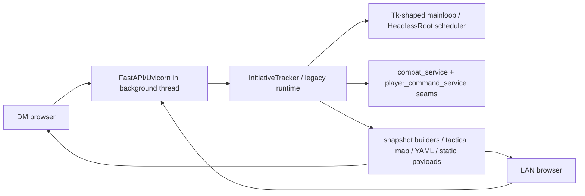
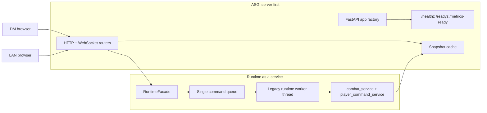
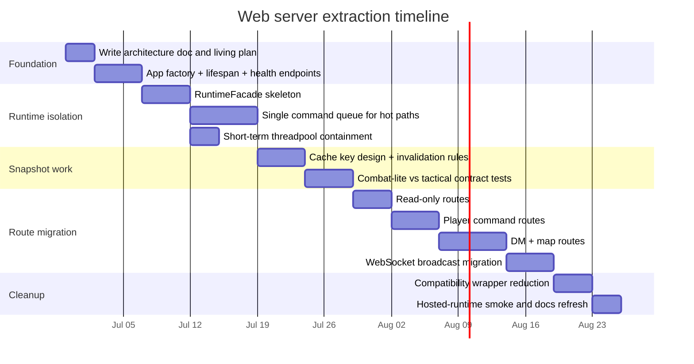

# Init Tracker Web Server Extraction Plan

## Executive summary

The repo now supports a headless launch seam, but it is not yet a true server-first runtime. `serve_headless.py` still sets `INIT_TRACKER_HEADLESS=1`, constructs the legacy tracker, and then blocks inside `app.mainloop()`, which means the web host is still spiritually and operationally downstream of the Tk-shaped runtime loop rather than being the primary owner of process lifecycle. citeturn47view0turn47view1turn42view2

The migration goal should therefore be stated plainly and durably as: **ASGI server first, runtime as a service**. In the target model, FastAPI/Uvicorn owns process startup, health, request handling, WebSocket lifecycle, and backpressure; the existing combat and player command logic becomes a callable runtime service behind a narrow façade; and expensive or blocking legacy work is isolated behind an explicit command queue and snapshot cache instead of running inline on the server’s responsiveness path. This recommendation follows both the repo’s existing service seams in `combat_service.py` and `player_command_service.py`, and official ASGI guidance that blocking work should not stall the event loop. citeturn47view2turn47view4turn23view0turn23view1turn26view0

The most important design conclusion is that a **real engine migration is not the next move**. The repo’s documented pain is latency, queue waits, tactical snapshot cost, and the fact that ordinary player actions can queue behind 10–20 second server work; the repo’s long-range TypeScript/runtime exploration is explicitly marked exploration-only, not active implementation. That means the highest-value sequence is: **extract server ownership first, isolate runtime second, reduce blocking paths third, then revisit renderer/runtime replacement later**. A full engine move is feasible, but it is a later-order architecture change, not the shortest path to eliminating the current operational failure mode. citeturn17view0turn46view2turn45view3

Similar systems that succeed with script-like runtimes almost all separate the request-serving shell from the heavy execution environment. Streamlit documents a server thread that handles HTTP/WebSocket work while per-session script threads run page code; Jupyter documents kernels as separate language processes that interact with server-side applications rather than embedding the whole runtime into the request loop; Home Assistant’s developer guidance is even more direct that blocking operations must be pushed out of the event loop or the system becomes unresponsive. Those official patterns line up closely with what this repo now needs. citeturn27view0turn26view2turn26view4turn26view0

## Repo-grounded current state and recency inventory

The strongest recency signal in the repo is not `majorTODO.md`; it is the current work ledger and recent commit stream. `docs/work_items/current_work.md` calls itself the authoritative source for what the orchestrator is currently doing, shows the repo idle at the moment, and records completed items through **2026-06-27**. The main branch commit stream also shows dense activity on **2026-06-26** and **2026-06-27**, centered on concrete bug work and workflow maintenance rather than broad platform rewrites. citeturn45view3turn35view0

By contrast, `majorTODO.md` still matters for platform direction, but its most relevant migration-related updates are explicitly dated **2026-05-22** and **2026-05-23**, and its TypeScript-first runtime language is still marked **exploration only**. That makes `majorTODO.md` important for long-range intent, but not the best authority for what agents should do next. The repo’s own rules reinforce this: `AGENTS.md` tells agents to prefer `docs/work_items/current_work.md`, and the work item management docs warn against reviving zombie plans from historical planning documents unless promoted into active work. citeturn46view0turn46view1turn46view2turn17view2turn18view0turn34view0turn34view1

The current architecture is also clearly transitional. The README says the app is desktop-first, with a Tk host or headless host for the DM side, a FastAPI plus WebSocket client for players, and a queue-based thread model where Tk stays on the main thread while the LAN server runs in a background thread. That is better than pure desktop coupling, but it is still the inverse of the desired production shape. citeturn44view0



The inventory below uses the best high-confidence recency evidence available from the repo contents and visible GitHub history. For some code files, exact per-path `git log -1` metadata was not recoverable in-session from GitHub’s web UI, so the table distinguishes between exact dated evidence and architectural recency heuristic.

| Artifact | Latest dated evidence or recency heuristic | Why it matters now |
|---|---|---|
| `docs/work_items/current_work.md` | Explicit completed entries through **2026-06-27**; declared authoritative current source. citeturn45view3 | Primary source for future agent decisions. |
| `majorTODO.md` | Platform migration notes dated **2026-05-22** and **2026-05-23**; TypeScript/runtime track still marked exploration-only. citeturn46view0turn46view1turn46view2 | Useful for direction, not immediate execution authority. |
| `serve_headless.py` | Current headless entrypoint; still launches tracker and blocks in `app.mainloop()`. citeturn47view0turn47view1 | Proof that headless exists, but server ownership is still incomplete. |
| `combat_service.py` | Existing backend seam; file describes itself as the authoritative source of truth for the migrated combat/session slice. citeturn47view2 | Best place to anchor a runtime façade instead of adding more tracker coupling. |
| `player_command_service.py` | Existing backend seam for player-originated combat commands with explicit ownership split. citeturn47view4 | Natural command queue boundary. |
| `map_state.py` | Large normalized tactical state object with terrain, hazards, structures, elevation, tokens, and AoEs; also includes ship fixtures and hazard presets. citeturn43view1turn43view0turn47view5 | Explains why snapshot generation can become heavy. |
| `runtime_config.py` | Production-path hygiene foundation was called out in `majorTODO`; current code centralizes runtime config and tactical-map feature flags. citeturn46view1turn42view1turn42view3 | Good home for runtime mode, queue, cache, and health config. |
| `tk_compat.py` | Headless seam is real, but it preserves the Tk `after()`/`mainloop()` shape rather than eliminating it. citeturn42view2turn42view4 | Evidence that headless reduced GUI dependence without solving loop ownership. |
| `assets/web/*` | `assets/web` currently contains `dm`, `dmcontrol`, `edit_character`, `lan`, `new_character`, `shop`, and `shop_admin`; `dm` and `dmcontrol` each expose `index.html`, while `lan` contains `index.html`, `sw.js`, and `pdfjs/`. citeturn38view0turn39view0turn39view1turn39view2 | Confirms the frontend surface area already assumes browser-first operation. |

The latency evidence is decisive. A May 22 runtime report says the app was materially improved but still “not playable” because ordinary actions randomly queued behind 10–20 seconds of server work, and the biggest cumulative spans were `_lan_snapshot`, `_dm_console_snapshot_payload`, `_dm_tactical_snapshot`, `_lan_force_state_broadcast`, and `lan.snapshot.build`. The same report records queue waits above 20 seconds and explicitly reframes the remaining release blocker as responsiveness rather than more frontend processing indicators. citeturn17view0

That diagnosis matches the repo’s tactical complexity. `map_state.py` is not a thin render model; it carries normalized grid, terrain, hazards, structures, elevation cells, token positions, and AoEs, plus ship fixtures and hazardous effect presets. In other words, the server path is doing real simulation- and projection-like work, not merely HTML serving. citeturn43view1turn43view0turn47view5

## Concrete design decisions and rationale

The first concrete decision should be to standardize on an **application factory** and move process ownership to the ASGI app. Uvicorn explicitly supports application factories through `--factory`, and FastAPI recommends lifespan-based startup and shutdown for one-time resource initialization and cleanup. That maps cleanly to creating the runtime service exactly once at startup, keeping it in application state, and shutting it down cleanly on process exit. citeturn33view1turn32view1turn32view2

The second decision should be to introduce a **runtime façade** instead of exposing `InitiativeTracker` directly to request handlers. The repo already has service seams: `combat_service.py` says combat/session state is backend-authoritative, and `player_command_service.py` says player-originated commands now go through an explicit backend seam with defined ownership. A façade should compose those existing seams and become the only object the ASGI layer knows about. That prevents more routes, middleware, or sockets from reaching back into tracker internals. citeturn47view2turn47view4

The third decision should be to make player and DM mutations travel through a **single command queue** owned by the runtime façade. This is not a speculative pattern; it fits the repo’s existing queue-based thread model from the README, and the latency report already shows that queueing, stale duplicate work, and snapshot rebuilds are central failure modes. The same report also documents a successful micro-pattern worth generalizing: `reaction_prefs_update` was taken out of the heavy combat action queue, and duplicate pending resource-pool updates were coalesced last-write-wins. The durable lesson is that command ingress must become explicit, serializable, observable, and coalescable. citeturn44view0turn17view0

The fourth decision should be a **snapshot cache split into static and dynamic layers**. The repo has already proven this direction works: `majorTODO.md` records that `_lan_snapshot` gained a static component cache, `_lan_force_state_broadcast` now defaults to `include_static=False`, and some hot paths were optimized by skipping projection work unless explicitly needed. The May 22 report further states that `/api/dm/combat` now returns combat-lite state by default and that explicit `/dm/map` and map mutation routes remain the tactical path. The correct next step is to formalize this as an architectural rule, not a one-off optimization. citeturn46view1turn17view0turn17view1

The fifth decision should be a **short-term threadpool isolation patch** for unavoidable blocking calls during extraction. FastAPI’s official guidance says plain `def` endpoints are run in an external threadpool and that blocking I/O should not run inline on the event loop; Starlette’s threadpool docs say the framework uses a thread pool to avoid blocking the event loop, but also warn the default pool is only 40 tokens; Home Assistant’s docs are even more blunt that if blocking work happens in the event loop, nothing else can run until it completes. This means threadpool offload is appropriate as a **temporary containment measure**, but not the end-state architecture. citeturn23view0turn23view1turn26view0turn26view3

The sixth decision should be to define **workspace-specific contracts** as first-class API concerns rather than baked-in tracker conditionals. The May 23 hotfix already introduced workspace-aware behavior for `/dm/map`, `/dmcontrol`, and `workspace=dmcontrol` query parameters so only map-capable workspaces force tactical payloads. That pattern should be preserved, but the decision logic should live near the ASGI contract and snapshot selector rather than inside a giant legacy runtime surface. citeturn17view1



### Sample app factory

```python
from __future__ import annotations

from contextlib import asynccontextmanager
from fastapi import FastAPI
from .routes import health, dm, lan
from .runtime_facade import RuntimeFacade


@asynccontextmanager
async def lifespan(app: FastAPI):
    runtime = RuntimeFacade()
    await runtime.start()
    app.state.runtime = runtime
    try:
        yield
    finally:
        await runtime.stop()


def create_app() -> FastAPI:
    app = FastAPI(lifespan=lifespan)
    app.include_router(health.router)
    app.include_router(dm.router, prefix="/api/dm")
    app.include_router(lan.router, prefix="/api/lan")
    return app
```

### Sample runtime façade

```python
from __future__ import annotations

from dataclasses import dataclass
from typing import Any

from .command_queue import CommandQueue
from .snapshot_cache import SnapshotCache


@dataclass
class RuntimeResult:
    ok: bool
    payload: dict[str, Any]
    version: int


class RuntimeFacade:
    def __init__(self) -> None:
        self.queue = CommandQueue()
        self.cache = SnapshotCache()
        self._worker = None  # legacy runtime owner thread/object

    async def start(self) -> None:
        self._worker = self.queue.start_worker(self._apply_command)

    async def stop(self) -> None:
        self.queue.stop()

    async def submit(self, command: dict[str, Any]) -> RuntimeResult:
        return await self.queue.submit(command)

    async def get_snapshot(self, *, workspace: str, include_static: bool) -> dict[str, Any]:
        cached = self.cache.get(workspace=workspace, include_static=include_static)
        if cached is not None:
            return cached
        snapshot = self._build_snapshot(workspace=workspace, include_static=include_static)
        self.cache.put(workspace=workspace, include_static=include_static, snapshot=snapshot)
        return snapshot

    def _apply_command(self, command: dict[str, Any]) -> RuntimeResult:
        # Delegate into combat_service / player_command_service / map APIs
        ...
        return RuntimeResult(ok=True, payload={"accepted": True}, version=123)

    def _build_snapshot(self, *, workspace: str, include_static: bool) -> dict[str, Any]:
        ...
```

### Sample command queue pattern

```python
from __future__ import annotations

import asyncio
import queue
import threading
from concurrent.futures import Future
from dataclasses import dataclass
from typing import Any, Callable


@dataclass
class QueueItem:
    command: dict[str, Any]
    future: Future


class CommandQueue:
    def __init__(self) -> None:
        self._queue: "queue.Queue[QueueItem | None]" = queue.Queue()
        self._thread: threading.Thread | None = None

    def start_worker(self, handler: Callable[[dict[str, Any]], Any]) -> threading.Thread:
        def run() -> None:
            while True:
                item = self._queue.get()
                if item is None:
                    return
                try:
                    result = handler(item.command)
                except Exception as exc:
                    item.future.set_exception(exc)
                else:
                    item.future.set_result(result)

        self._thread = threading.Thread(target=run, name="runtime-worker", daemon=True)
        self._thread.start()
        return self._thread

    async def submit(self, command: dict[str, Any]) -> Any:
        loop = asyncio.get_running_loop()
        fut: Future = Future()
        self._queue.put(QueueItem(command=command, future=fut))
        return await asyncio.wrap_future(fut, loop=loop)

    def stop(self) -> None:
        self._queue.put(None)
        if self._thread is not None:
            self._thread.join(timeout=5)
```

### Sample short-term `run_in_threadpool` usage

```python
from fastapi import APIRouter, Request
from starlette.concurrency import run_in_threadpool

router = APIRouter()

@router.post("/legacy/long-rest")
async def long_rest(request: Request) -> dict:
    runtime = request.app.state.runtime

    def blocking_apply() -> dict:
        # temporary containment only; long-term path is queue submission
        return runtime._apply_command({"type": "long_rest", "source": "dm-http"})

    result = await run_in_threadpool(blocking_apply)
    return {"ok": True, "result": result}
```

## Step-by-step implementation plan

The safest path is not a big-bang rewrite. It is a staged extraction where the server becomes authoritative first, the runtime becomes a service second, and only then do you start replacing deeper internals. This sequencing fits both the repo’s narrow-task agent rules and the operational evidence that responsiveness, not capability breadth, is the real blocker. citeturn18view0turn17view2turn17view0

| Milestone | Effort | Exit condition |
|---|---|---|
| Server ownership shell | Medium | Uvicorn/FastAPI starts via factory, exposes `/healthz` and `/readyz`, and boots runtime in lifespan. |
| Runtime façade and queue | High | All mutating HTTP/WS paths enter through `RuntimeFacade.submit()`. |
| Snapshot split and cache hardening | High | `combat-lite` vs `tactical` snapshots are explicit contracts with observably fewer rebuilds. |
| Route migration and legacy shrink | High | DM/LAN routes no longer reach tracker internals directly. |
| Hosted-runtime readiness | Medium | Process can run stably as server-first, without Tk-shaped loop ownership. |

### Server ownership shell

Create a small package such as `server_app/` with `create_app()`, `lifespan`, `routes/health.py`, and `routes/bootstrap.py`. The first success state is deliberately modest: the app starts with `uvicorn --factory`, exposes health endpoints, and owns startup/shutdown of the runtime façade. Keep `serve_headless.py` temporarily, but reduce it to a compatibility launcher that simply calls the factory-backed server entrypoint rather than constructing the tracker itself. citeturn33view1turn32view1turn32view2turn47view0

Acceptance tests should be simple and operational. Add a health loop that proves unrelated requests stay responsive during a synthetic long-running legacy action.

```bash
uvicorn --factory server_app.main:create_app --host 127.0.0.1 --port 8787 &
SERVER_PID=$!

for i in $(seq 1 20); do
  curl -fsS http://127.0.0.1:8787/healthz || exit 1
  sleep 0.25
done

kill $SERVER_PID
```

### Runtime façade and queue

Introduce `RuntimeFacade` and route all mutation-style calls through it, starting with the most latency-sensitive commands: movement, end turn, manual resource overrides, and long rest. The rationale is repo-local and strong: those are exactly the kinds of actions previously observed to sit behind long queue waits or expensive snapshot builds. Coalescing rules should be explicit for last-write-wins commands such as reaction preferences and repeated resource-pool adjustments. citeturn17view0

Verification should include request-level tests and a concurrency smoke. A good first test is to trigger one intentionally slow command and ensure `/healthz` continues responding within a low latency budget while the runtime worker processes the mutation.

```bash
python -m pytest tests/test_server_health.py tests/test_runtime_queue.py -q
python -m pytest tests/test_dm_tactical_map_routes.py -q
```

### Snapshot split and cache hardening

Codify two snapshot classes: **dynamic combat-lite** and **explicit tactical**. The repo already moved in this direction when `/api/dm/combat` stopped building tactical snapshots by default and map/control workspaces forced tactical views only when explicitly requested. Turn that into stable API policy with cache keys such as `(workspace, include_static, map_revision, combat_revision)`. citeturn17view0turn17view1turn46view1

Acceptance tests should prove negative as well as positive behavior: `/api/dm/combat` without workspace context must not produce `tactical_map`; `/api/dm/combat?workspace=dmcontrol` must; repeated `combat-lite` polling should hit cache; and map mutation should invalidate only the tactical slice unless a command truly changes static state. citeturn17view1turn17view0

### Route migration and legacy shrink

After the façade exists, migrate routes in slices instead of by subsystem rhetoric. A good order is: health/bootstrap, read-only snapshots, player mutation routes, DM combat routes, tactical map routes, then WebSocket broadcast paths. The target is that no ASGI endpoint reaches directly into `InitiativeTracker` internals without going through the façade or explicit read model. citeturn47view2turn47view4

Verification should include diff-scoped compile checks, existing tactical route tests, and one browser-smoke-compatible route slice at a time. That matches the repo’s existing discipline of narrow validation and timeout-bounded tests. citeturn34view2turn18view0

### Hosted-runtime readiness

Once the server fully owns lifecycle and routing, the final short-term milestone is to remove Tk-shaped loop ownership from the normal hosted path. `HeadlessRoot` was an effective bridge because it preserved `after()` and `mainloop()` semantics for code that expected them, but the target state is to need that shim only for compatibility surfaces, not for the primary host model. At that point, `serve_headless.py` can become either a thin wrapper or be formally deprecated. citeturn42view2turn47view1



## Agent workflow and repo documentation protocol

The repo already has the bones of a strong agent discipline, and this migration should reinforce that instead of inventing a parallel process. `AGENTS.md` says the repo is durable and chat is volatile, prefers `docs/work_items/current_work.md`, and requires one narrow task per pass with minimal inspection. The work item docs say `current_work.md` is the authoritative ledger, and the runtime report on living document control says agents must not revive stale plans outside that ledger. citeturn17view2turn18view0turn34view0

The migration should therefore be documented with a small permanent document set, each with a distinct role. The minimum durable set should be:

- `docs/architecture/asgi_runtime_service_architecture.md` — long-lived architecture decision record for server-first ownership.
- `docs/planning/web_server_extraction_living_plan.md` — migration plan and milestone tracker.
- `docs/work_items/active/WORK-YYYYMMDD-server-first-<slug>.md` — one bounded execution packet at a time.
- `docs/work_items/current_work.md` — authoritative activation and completion ledger.
- `majorTODO.md` — high-level platform direction only, updated when a durable milestone lands, not used as the active task packet. citeturn18view0turn18view2turn46view2

Agents should follow this rigid routine:

1. Read `AGENTS.md`.
2. Read `docs/work_items/current_work.md`.
3. If no active item exists, stop execution and create or request a bounded work item rather than free-form coding.
4. Read only the allowed files listed in that work item.
5. Make one narrow change.
6. Record validation evidence in the work item.
7. Update `current_work.md`.
8. If the change affects strategy or architecture, update the architecture or living-plan doc in the same pass. citeturn17view2turn18view0turn34view0turn34view2

Use the following naming conventions consistently:

- **Work items:** `WORK-YYYYMMDD-server-first-<slug>.md`
- **Bug promotions:** preserve the repo’s existing `BUG-YYYYMMDD-...` style when the source is a defect report. citeturn34view1turn45view3
- **Architecture docs:** `docs/architecture/<topic>.md`
- **Planning docs:** `docs/planning/<topic>_living_plan.md`

Recommended commit message templates:

```text
WORK-20260629-server-first-app-factory: add ASGI app factory and lifespan health shell
WORK-20260629-runtime-facade: route DM mutations through RuntimeFacade queue
WORK-20260629-snapshot-cache: split combat-lite and tactical snapshot cache keys
DOC-20260629-server-first: persist architecture decision and migration ledger
```

Recommended PR checklist for future agents:

- Scope matches work item allowed files.
- `current_work.md` updated.
- Architecture doc updated if behavior or ownership changed.
- Validation evidence pasted into work item.
- Health loop or route smoke included when server paths changed.
- Browser-facing asset changes include JS syntax check.
- No broad extra tests beyond scope; timeout-bounded if needed. citeturn17view2turn18view0turn34view2

## Migration options and engine migration difficulty

The repo’s own evidence makes the ordering decision clearer than it might seem from a distance. The current pain is not that Tk cannot render a tactical map attractively enough; it is that web-facing work still waits behind slow snapshot generation, projection work, and legacy runtime ownership. The logic seams are already being carved out in Python, and the browser surfaces already exist. That makes a real engine move a later option, not the first corrective action. citeturn17view0turn44view0turn46view2

| Option | Difficulty | Cost | Recommended order |
|---|---:|---:|---:|
| Short-term containment patch: app factory, health endpoints, queue hot paths, threadpool for unavoidable blockers | Medium | Low to medium | First |
| Browser renderer/UI swap while keeping Python runtime authority | Medium to high | Medium | Second |
| TypeScript runtime migration for hosted/web core | High | High | Third |
| Full game engine migration | Very high | Very high | Last, if ever |

The short-term containment patch is the best first move because it directly addresses the current blocker the repo names: responsiveness. It also compounds well with everything else; even if you later move to TypeScript or an engine shell, you still want explicit server lifecycle, health probes, command boundaries, snapshot contracts, and a runtime façade. citeturn17view0turn23view0turn32view1

A browser renderer swap without changing runtime authority can make sense after extraction if the main goal is UX or maintainability on the frontend side. The repo already has browser-first surfaces in `assets/web`, and `/dmcontrol` and map workspaces show that the browser operator model is not speculative. But this only becomes attractive after the server is no longer being stalled by legacy runtime work. citeturn38view0turn39view0turn39view1turn39view2turn17view1

A TypeScript runtime is plausible long term because `majorTODO.md` explicitly names a server-resident, TypeScript-first hosted target with Tk retired from the main runtime path. But that same document marks the effort as exploration-only, and the recent commit stream does not show active platform rewrite work. The right way to de-risk that future is to extract contracts now so the implementation language can change later without dragging the current monolith across the boundary. citeturn46view2turn35view0

A full engine migration is the hardest option because it creates the most simultaneous change at the least helpful boundary. Today’s repo owns a large rules-and-state domain: YAML-driven data, combat authority, map state normalization, player command flows, DM workspaces, and mixed HTTP/WebSocket interactions. An engine would mostly replace presentation and some realtime scene handling, but it would not automatically solve queue waits, snapshot invalidation, backend contracts, or lifecycle ownership. In fact, doing it too early would add a renderer rewrite to a server extraction that is already large. citeturn44view0turn47view2turn47view4turn43view0turn43view1

## Risks, blockers, and mitigation strategy

The main blocker is **heavy snapshot cost**, not mere route organization. The May 22 runtime report names `_lan_snapshot`, `_dm_console_snapshot_payload`, `_dm_tactical_snapshot`, `_lan_force_state_broadcast`, and `lan.snapshot.build` as dominant spans, and it explicitly says startup/full static hydration can still be expensive after the playability pass. That means extraction must include explicit cache design and invalidation rules, not just moving route definitions into prettier files. citeturn17view0

The second blocker is **tactical and map-state complexity**. `map_state.py` is rich enough to behave like a simulation data model: hazards, features, structures, elevation, token positions, AoEs, and ship fixtures all live inside one normalized state. If you do not separate combat-lite reads from tactical reads and dynamic-only from static-heavy work, the new architecture will preserve the same costs behind a tidier API shell. citeturn43view0turn43view1turn47view5

The third blocker is **legacy loop shape**. `tk_compat.py` and `serve_headless.py` show that the current headless host intentionally preserves `after()` and `mainloop()` semantics so the tracker can keep running unchanged. That was the right bridge, but it also means a naive migration can get stuck in a “headless but still loop-owned by legacy runtime” halfway state. The mitigation is to define a hard rule: the hosted path must boot from ASGI lifespan, and the compatibility loop must not remain the owner of process lifetime. citeturn42view2turn42view4turn47view0turn47view1

The fourth blocker is **agent drift into stale planning**. The repo already identified zombie-plan behavior as a real problem, and the migration is exactly the kind of long-running architectural topic that can attract it. The mitigation is to keep one living architecture doc, one living plan, one active work item, and one authoritative ledger, with work always promoted into the ledger before execution. citeturn34view0turn34view1turn18view0

The fifth blocker is **threadpool misuse as a fake finish line**. Threadpool offload is a valid containment step, and the official docs support it for blocking work, but Starlette also warns about shared threadpool capacity limits and Home Assistant warns about deadlocks and incorrect async/thread interaction. The mitigation is to label all `run_in_threadpool` use as temporary, keep it close to transition edges, and move durable command execution into the runtime queue as soon as each slice is extracted. citeturn23view1turn26view0turn26view3

### Open questions and limitations

I have high confidence in the migration direction, the design decisions, and the recommended sequencing. The one place where confidence is lower is the **exact per-file last-modified date** for each requested artifact: the repo’s visible content and branch commit history make the recency ordering clear, but exact path-specific `git log -1` metadata was not recoverable for every listed file through the GitHub web UI during this session. The inventory above therefore uses exact dated evidence where available and clearly-labeled recency heuristics where it is not. citeturn35view0turn45view3turn46view0

## References

The repo sources point in one direction: the project has already begun separating backend authority from UI ownership, recent work is being tracked through the work ledger rather than broad milestone prose, and the remaining blocker is server responsiveness under mixed mutation and snapshot load. The migration plan above simply turns those partially-realized repo patterns into an explicit long-term architecture. citeturn45view3turn17view2turn17view0turn46view2

Primary repo references used for this plan:

- `AGENTS.md` for repo-owned agent discipline and source preference. citeturn17view2
- `docs/work_items/README.md` and `docs/work_items/templates/work_item_template.md` for authoritative work ledger and bounded task execution. citeturn18view0turn18view1
- `.github/instructions/docs-tracker.instructions.md` for documentation tracker expectations. citeturn18view2
- `docs/work_items/current_work.md` for current recency and authoritative active state. citeturn45view3turn45view1
- `majorTODO.md` for long-range platform intent and late-May migration notes. citeturn46view0turn46view1turn46view2
- `serve_headless.py`, `tk_compat.py`, `combat_service.py`, `player_command_service.py`, and `map_state.py` for current seam and runtime-shape analysis. citeturn47view0turn47view1turn42view2turn42view4turn47view2turn47view4turn43view0turn43view1turn47view5
- `docs/runtime_reports/final_playability_latency_amputation_20260522.md` and `docs/runtime_reports/hotfix_dm_map_combat_lite_regression_20260523.md` for the concrete latency and workspace-routing evidence behind the migration. citeturn17view0turn17view1
- Main branch commit stream for recency comparison. citeturn35view0

Authoritative external references used for the server-first design:

- FastAPI on `def` vs `async def`, threadpool behavior, and blocking work guidance. citeturn23view0
- FastAPI lifespan-based startup/shutdown design. citeturn32view1
- FastAPI bigger-applications guidance for modular route layout. citeturn32view0
- Starlette threadpool guidance and capacity-limit warning. citeturn23view1
- Starlette background task model. citeturn23view3
- Uvicorn ASGI application factories and programmatic server control. citeturn33view1turn33view2

Comparable official patterns and case-study analogues:

- Home Assistant docs on blocking operations and executor jobs. citeturn26view0turn28view0
- Home Assistant docs on async/thread interaction and deadlock caution. citeturn26view3
- Streamlit’s server-thread versus script-thread architecture. citeturn27view0turn27view2
- Jupyter Server and Jupyter kernel architecture showing server/runtime separation. citeturn26view2turn26view4
- Celery and Dramatiq official documentation for longer-horizon external worker patterns if the in-process queue later needs promotion to a broker-backed worker model. citeturn30view0turn30view1turn30view2