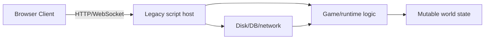
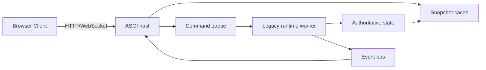
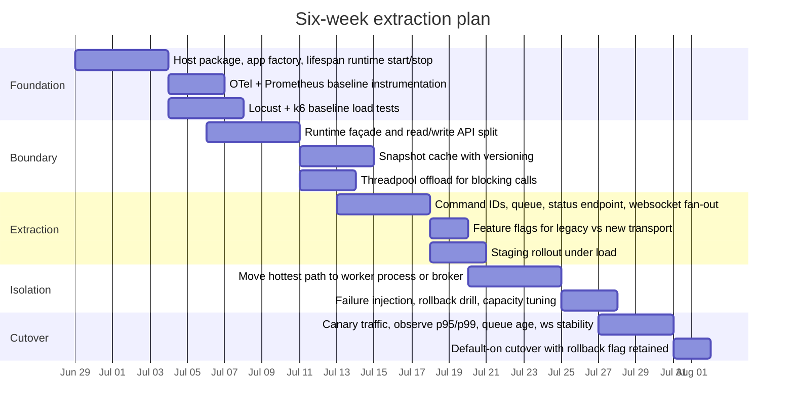

# Extracting a Script-Hosted Runtime into an ASGI Host

## Executive summary

The pattern you are asking about is real, well-documented in adjacent systems, and usually worth doing when the current architecture lets slow runtime work block HTTP or WebSocket responsiveness. The strongest public evidence does not come from VTT postmortems specifically, but from nearby networked systems that already made this split explicit: Jupyter moved from Notebook Server toward Jupyter Server as the backend host while kernels stayed behind a WebSocket-to-ZeroMQ bridge; Matrix Synapse documents the move from monolith mode to separate worker processes coordinated through Redis; Apache Airflow separates web server, scheduler, workers, broker, and result backend; and Rasa cleanly externalizes custom actions behind an action server that can speak either HTTP or gRPC. Those examples all converge on the same architectural lesson: the request-serving layer should own the port, and the mutable or slow runtime should sit behind a narrow command/state boundary. citeturn22view14turn22view16turn22view17turn22view18turn22view3turn23view7turn22view5turn22view6turn22view7

For your situation, the most practical recommendation is an **inverted ownership model**. Let FastAPI or Starlette be the process host, start the legacy runtime in application lifespan, and expose only a small façade to routes and WebSockets: `query_state()`, `submit_command()`, `subscribe_events()`, and `warm_snapshot()`. In the first phase, keep this façade in-process and use threadpool offload or a small worker process for the heavy runtime calls. In the second phase, if latency and fault isolation still are not good enough, move the façade across a process boundary using either `multiprocessing`, Redis/RQ, RabbitMQ/Celery, or gRPC over a Unix domain socket. Starlette and AnyIO explicitly support thread and process offload patterns for blocking or CPU-intensive work, and FastAPI’s docs explicitly distinguish small same-process background work from heavier jobs that should use a queueing system such as Celery. citeturn24view4turn24view5turn24view1turn24view2turn33view1turn29view0

The architectural difficulty is usually **moderate, not extreme**, if you avoid a full rewrite and instead perform an extraction around a runtime façade. The hard part is not “adopting ASGI”; it is identifying what counts as authoritative state, what commands mutate it, which operations are safe to offload, and how to keep snapshots coherent while the old runtime still exists. If you already have a mostly authoritative single-runtime model, the extraction is significantly easier than migrating directly into a “real game engine” networking stack, because the ASGI extraction gives you a stable transport boundary first. That boundary later becomes the seam where a future engine-hosted or engine-adjacent runtime can plug in. This is the same shape seen in server-authoritative game stacks such as Colyseus and Nakama, where the server owns state mutation and clients subscribe to changes rather than directly driving world state. citeturn23view8turn22view11

My recommended end state is straightforward: **ASGI owns HTTP/WebSocket, a runtime worker owns world logic, all slow mutations become commands, and clients mostly read from a snapshot cache plus event stream**. On a no-budget-constraint deployment, I would aim for a two-step architecture: first in-process façade plus thread/process offload, then a dedicated runtime service behind gRPC or a durable broker if you need stronger isolation, replay, or multi-language interoperability. Uvicorn supports HTTP and WebSockets, Starlette is purpose-built for async web services with lifespan and in-process background tasks, FastAPI offers production-friendly routing structure, and Gunicorn still works as a process manager for Uvicorn-based services, though Uvicorn now documents `uvicorn.workers` as deprecated in favor of the `uvicorn-worker` package. citeturn35view0turn35view1turn27view1turn19view10turn22view0

**Assumptions used for the actionable parts below**

- Your target stack is Python ASGI.
- The legacy runtime is mostly synchronous, or at least contains sync hot spots.
- The client surface includes HTTP plus some real-time channel such as WebSockets.
- State can be represented as versioned snapshots plus append-only commands/events.
- Hosting and broker choices are unconstrained by budget.

## What the documented migrations show

The clearest “host inversion” example is **Jupyter**. Jupyter Server is documented as the backend that provides core services, APIs, and REST endpoints for Jupyter web applications, and it is explicitly described as the replacement for the Tornado Web Server in Jupyter Notebook. Jupyter’s runtime model is also exactly the kind of split you care about: the browser speaks WebSocket to Jupyter Server, while kernels sit behind ZeroMQ sockets, with Jupyter Server acting as the translation bridge. That is not a game server, but it is a very close analogue to “HTTP/WebSocket host in front, legacy execution runtime behind.” It shows that the extraction can be evolutionary rather than a rewrite: configs migrate, naming changes, and the runtime boundary becomes formalized instead of implicit. citeturn22view14turn22view13turn22view16

**Matrix Synapse** is the strongest official example of turning a monolith into a worker system without throwing away the existing codebase. Synapse’s worker docs say small instances can run in monolith mode, but larger ones can split functionality into multiple separate Python processes that are intended to scale horizontally. The current worker setup also requires Redis to manage communication between these processes. This is extremely relevant because the migration is not framed as “rewrite into microservices”; it is framed as “extract functions behind process boundaries where performance pressure is felt.” That is usually the right mental model for script-hosted runtimes too. citeturn22view17turn22view18

**Apache Airflow** demonstrates the operational payoff of separating the host/UI from work execution. In the CeleryExecutor architecture, the system explicitly distinguishes workers, scheduler, web server, database, broker, and result backend. Airflow’s executor docs also make the trade-off very plainly: local executors are easy and low-latency but share resources with the scheduler, while queued remote executors are more robust because workers are decoupled from the scheduler and can stay warm to take work immediately from the queue. That is the exact trade-off you are dealing with when a script-hosted web server and a slow runtime fight over the same event loop or process resources. citeturn22view3turn23view7

**Rasa** shows the same extraction pattern at a smaller, more direct scale. The main server predicts a custom action, then sends a `POST` request to an external action server, which returns responses and events; the action server can also run over gRPC instead of HTTP, and its protobuf contract is published in the docs. That is architecturally close to a legacy game runtime becoming a “world/action service” behind a host API. The important lesson is not the chatbot domain; it is the discipline of pushing slow or domain-heavy behavior behind an explicit network contract while keeping the front door fast and observable. citeturn22view5turn22view6turn22view7

Public **VTT-specific** evidence is thinner, but the available official docs still help define the target shape. Foundry VTT documents itself as a self-hosted platform where players connect to a game server through a web browser, and its hosting guide says self-hosted deployments commonly run through the packaged Electron app while players connect directly to that machine. That is useful as a baseline because it confirms the VTT world still commonly bundles runtime and serving concerns together. By contrast, modern real-time game backends such as Colyseus and Nakama make the authoritative split explicit: Colyseus says the server is responsible for mutating room state and the client listens for state changes; Nakama exposes an in-memory region for authoritative matches to store state for the duration of the match. In other words, the *destination architecture* is already clear in adjacent game tech even when public migration writeups are not. citeturn22view8turn22view9turn23view8turn22view11

The practical conclusion from these case studies is simple: **the successful migrations formalize the boundary before they optimize it**. They do not start with a broker, a mesh, or a rewrite. They start by deciding: what is the host, what is the worker, what crosses the boundary, and what state representation is safe to expose. That is why the right first move for a script-hosted runtime is almost never “port everything to a real engine immediately”; it is “make the runtime behave like a service first.” The examples above consistently support that sequence. citeturn22view14turn22view17turn22view3turn22view5

## Migration patterns that consistently work

The first recurring pattern is the **app factory plus lifespan-owned runtime**. FastAPI’s own guidance for bigger applications is that real applications rarely fit in one file, and FastAPI provides an application structure around modules and `APIRouter`s. Starlette’s lifespan hooks let the application create shared resources before serving requests and tear them down after connections close, and Starlette explicitly says it will not start serving until lifespan has run. That makes lifespan the right place to initialize your legacy runtime, warm caches, create queues, and start a worker task or process. citeturn27view1turn23view2

```python
# app/factory.py
from contextlib import asynccontextmanager
from fastapi import FastAPI
from .routes import http, ws
from .runtime import RuntimeFacade

@asynccontextmanager
async def lifespan(app: FastAPI):
    runtime = RuntimeFacade()
    await runtime.start()          # warm snapshot cache, start workers
    app.state.runtime = runtime
    try:
        yield
    finally:
        await runtime.stop()

def create_app() -> FastAPI:
    app = FastAPI(lifespan=lifespan)
    app.include_router(http.router)
    app.include_router(ws.router)
    return app

app = create_app()
```

The second pattern is the **runtime façade**. Routes should not “know” the old runtime’s internals. They should speak to a narrow service object with operations such as `get_snapshot(world_id)`, `submit(command)`, `subscribe(session_id)`, and `health()`. This façade is what lets you swap the transport later: today it can call into in-process code; later it can enqueue to Redis, call gRPC, or hand work to a child process without changing route logic. Jupyter’s WebSocket-to-kernel bridge, Rasa’s action server contract, and Synapse’s worker split all reinforce this idea of formalizing the boundary instead of letting handlers reach directly into runtime internals. citeturn22view16turn22view5turn22view17

The third pattern is **offload, then extract**. Starlette documents that it uses a thread pool to avoid blocking the event loop, and that synchronous code is run through `anyio.to_thread.run_sync`. It also documents a default pool size of 40 tokens shared with FastAPI’s sync dependency execution. AnyIO then gives you the next step up: use worker threads for blocking operations, and use worker processes for CPU-intensive work, because Python generally cannot execute Python code in multiple threads at once for CPU-bound tasks. This yields a very practical rule: if the runtime call is mostly blocking I/O or some long sync code you cannot immediately untangle, offload it to threads; if it is CPU-heavy snapshot generation, pathfinding, rules evaluation, or serialization, move it to a worker process sooner. citeturn24view4turn24view5turn24view1turn24view2turn33view1

```python
# app/routes/http.py
from fastapi import APIRouter, Request, HTTPException
from starlette.concurrency import run_in_threadpool

router = APIRouter()

@router.post("/commands/{world_id}")
async def submit_command(world_id: str, body: dict, request: Request):
    runtime = request.app.state.runtime
    try:
        # Good first-step patch for sync/blocking legacy code
        command_id = await run_in_threadpool(runtime.submit_sync, world_id, body)
    except TimeoutError as exc:
        raise HTTPException(status_code=503, detail="runtime overloaded") from exc
    return {"command_id": command_id, "status": "accepted"}
```

The fourth pattern is the **command queue plus snapshot cache**. Instead of doing heavy mutations inline inside the request handler, accept a command quickly, enqueue it, and return a command ID or immediate ack. The runtime worker applies the command, updates authoritative state, increments a snapshot version, and emits an event for WebSocket subscribers. Reads are then served from a versioned snapshot cache rather than directly from the mutation path. This is the same broad idea behind Rasa’s front-server/action-server split, Airflow’s queued remote executors, and server-authoritative game backends where the server alone mutates canonical state. citeturn22view5turn23view7turn23view8turn22view11

```python
# app/runtime.py
import asyncio
from dataclasses import dataclass
from uuid import uuid4

@dataclass
class Command:
    id: str
    world_id: str
    payload: dict

class RuntimeFacade:
    def __init__(self):
        self.queue: asyncio.Queue[Command] = asyncio.Queue()
        self.command_status: dict[str, str] = {}
        self.snapshots: dict[str, dict] = {}
        self._task = None

    async def start(self):
        self._task = asyncio.create_task(self._consume())

    async def stop(self):
        if self._task:
            self._task.cancel()

    async def submit(self, world_id: str, payload: dict) -> str:
        cmd = Command(id=str(uuid4()), world_id=world_id, payload=payload)
        self.command_status[cmd.id] = "queued"
        await self.queue.put(cmd)
        return cmd.id

    async def _consume(self):
        while True:
            cmd = await self.queue.get()
            self.command_status[cmd.id] = "running"
            try:
                # call legacy runtime here
                new_snapshot = {"world_id": cmd.world_id, "version": uuid4().hex}
                self.snapshots[cmd.world_id] = new_snapshot
                self.command_status[cmd.id] = "finished"
            except Exception:
                self.command_status[cmd.id] = "failed"
            finally:
                self.queue.task_done()
```

Before the extraction, the system usually looks like this:



After extraction, the healthier shape looks like this:



The fifth pattern is **WebSocket ownership staying with the host**. Uvicorn supports HTTP and WebSockets, and its WebSocket docs make the handshake and event flow explicit inside the ASGI layer. In practice that means the ASGI host should keep responsibility for client sessions, authentication, subscription bookkeeping, and backpressure, while the runtime worker only emits domain events and processes commands. This is especially important if your existing architecture currently lets the runtime’s loading pauses or long loops stall the same code path that should be servicing browser connections. citeturn35view0turn35view3

## IPC and worker choices

There is no single best IPC choice. The right one depends on how much durability, isolation, and future interoperability you need. The cleanest way to think about the decision is to ask four questions: do you need the command to survive process crashes, do you need replay, do you need non-Python workers, and do you need the absolute lowest possible latency? The Python standard library queues and AnyIO worker threads/processes cover the low-complexity end; Redis/RQ and RabbitMQ/Celery cover the durable queueing middle; and gRPC or Unix sockets cover the “explicit service boundary” end. Official docs support the key capability differences: `asyncio.Queue` is async-only and not thread-safe, `queue.Queue` is thread-safe for threads, `multiprocessing.Queue` serializes objects across processes, Redis Pub/Sub is at-most-once and lossy on subscriber failure, Redis Streams add replay and consumer groups, RQ is Redis-backed with a low barrier to entry, Celery is a broker-mediated task queue with dedicated workers, RabbitMQ is interoperable and supports acknowledgements, and gRPC is designed for high-performance RPC across languages with streaming. citeturn26view2turn26view1turn26view0turn20view0turn20view1turn20view3turn20view4turn20view5turn30view2turn20view8turn31view1turn20view9turn26view4

The table below is a **design synthesis, not a benchmark**. “Latency” is relative architectural expectation, not a vendor-measured SLA.

| Option | Latency | Complexity | Persistence | Interop |
|---|---|---:|---|---|
| `asyncio.Queue` | Lowest | Low | None | Python async only |
| `queue.Queue` | Lowest | Low | None | Python threads only |
| `multiprocessing.Queue` | Low | Medium | Process-local only | Python only |
| Redis Pub/Sub | Low | Medium | None, at-most-once | Good |
| Redis Streams / RQ | Low–Medium | Medium | Yes, replay/retention | Good |
| Celery with Redis/RabbitMQ | Medium | High | Yes | Good, mostly job-oriented |
| RabbitMQ consumers directly | Medium | Medium–High | Yes | Excellent |
| gRPC | Low | Medium–High | No by default | Excellent |
| Unix domain socket RPC | Lowest–Low | Medium | No by default | Local host only |
| WebSockets as internal IPC | Low | Medium | No by default | Good, but awkward for jobs |

If you want the **fastest incremental step**, use in-process `asyncio.Queue` for async handlers or `queue.Queue` plus threadpool offload for sync runtime work. Python documents `asyncio.Queue` as not thread-safe and specific to async code, while `queue.Queue` is the synchronized choice for threads. That combination is excellent for a same-host extraction stage, but it gives you no durability and limited fault isolation. It is best treated as a stepping stone, not the final architecture for a high-value authoritative runtime. citeturn26view2turn26view1

If you want **same-host isolation with low conceptual overhead**, `multiprocessing.Queue` or AnyIO worker processes are often the best next step. `multiprocessing.Queue` supports multiple producers and consumers, but Python notes that objects are pickled when placed on the queue and reconstructed on the other side, which is a real cost if your commands or snapshots are huge. AnyIO’s process offload docs are especially important here: worker processes are better than threads for CPU-intensive code, but the target callable and arguments need to be pickleable, and import-time side effects must be guarded carefully. For a runtime that is blocking on rules evaluation or snapshot construction rather than network I/O, this can be the sweet spot before you adopt an external broker. citeturn26view0turn33view1

If you want **a quick durable queue without a huge framework jump**, Redis plus RQ is attractive. RQ describes itself as a simple library for queueing jobs and processing them in the background with workers, backed by Redis or Valkey, with a low barrier to entry. It also gives you retrieveable job IDs and status inspection. That makes it an excellent fit for “accept command, return command ID, poll or push result later.” The main downside is that it is Python-centric and less expressive than a full brokered messaging architecture if your runtime eventually becomes polyglot. citeturn20view4turn25view1

If you want **full task orchestration**, Celery is the standard Python answer. Celery defines task queues as a mechanism to distribute work across threads or machines, with dedicated worker processes monitoring queues while a broker mediates messages between clients and workers. It supports multiple brokers and result stores, including RabbitMQ and Redis. The price is operational and conceptual complexity. For an extraction project, Celery is justified when you already know you need retries, scheduling, fan-out, multiple separate workers, or cross-host scaling early in the migration. It is often too heavy for the very first extraction pass. citeturn20view5turn19view6turn19view7

If you want **a language-agnostic internal backbone**, RabbitMQ or gRPC are stronger long-term choices than RQ. RabbitMQ is explicitly positioned as interoperable, with support for several open standard protocols and client libraries across languages, plus acknowledgements and replicated messaging options. gRPC is a high-performance RPC framework that works across languages and platforms and supports bi-directional streaming over HTTP/2. In practice, RabbitMQ is better when you think in terms of queued commands and asynchronous processing; gRPC is better when you want an explicit service API with typed request/response contracts and streaming event channels. citeturn30view2turn20view8turn31view1

For **single-host deployments**, Unix domain sockets are underrated. Uvicorn documents `--uds` support for binding behind a reverse proxy, and Python’s `socketserver` docs note that Unix-domain socket server types exist specifically on non-Windows Unix platforms. A local gRPC server or small custom RPC service on a Unix socket gives you an explicit process boundary with very low local overhead, without immediately introducing a broker. If you have no hosting or budget constraints but do want minimal moving parts, this is often the cleanest “real service” step after an in-process façade. citeturn20view9turn26view4

## ASGI stack, observability, rollout, and rollback

For the host itself, the cleanest Python stack is usually **FastAPI on Starlette on Uvicorn**. FastAPI is positioned as a modern high-performance web framework; Starlette is the lower-level ASGI toolkit that is ideal for async web services and includes WebSockets, lifespan, and in-process background tasks; and Uvicorn is the ASGI server that supports HTTP/1.1 and WebSockets. This stack aligns almost perfectly with the “HTTP/WebSocket host in front of runtime worker” model because it gives you request routing, WebSocket sessions, startup/shutdown lifecycle, and offload hooks without forcing your world runtime into the web layer. citeturn35view2turn35view1turn35view0

For process management, there are two sane paths. Uvicorn can replicate workers directly, and FastAPI’s deployment docs say one Uvicorn process manager can listen on the public port and start multiple worker processes. If you prefer Gunicorn as the process manager, that still works, and Gunicorn’s docs clearly explain its pre-fork arbiter/worker model. The one current caveat is important: Uvicorn documents the old `uvicorn.workers` module as deprecated and recommends the separate `uvicorn-worker` package instead. So the contemporary guidance is either “Uvicorn workers directly” or “Gunicorn plus `uvicorn-worker`.” citeturn23view6turn22view2turn22view0turn19view10

FastAPI and Starlette do offer **in-process background tasks**, but their own docs draw a useful boundary. FastAPI says background tasks are good for work that can happen after a response returns and that small same-process tasks are reasonable; it also explicitly says that for heavy background computation, especially if you do not need same-process memory sharing, bigger tools like Celery may be more appropriate. Starlette’s background task docs also say these tasks run after the response is sent and in order. That makes them suitable for lightweight bookkeeping, metrics flushes, cache refresh triggers, or notifications, but not for the main authoritative runtime loop or expensive snapshot recomputation. citeturn29view0turn29view1

For observability, instrument the host and the runtime differently. OpenTelemetry’s FastAPI instrumentation supports automatic and manual instrumentation of FastAPI apps, while the ASGI middleware can instrument request timing across any ASGI framework. Prometheus client libraries then expose internal metrics on an HTTP endpoint. For extraction work, that gives you exactly what you need: request duration histograms on the ASGI side, queue depth and command age gauges on the façade side, and runtime work duration plus snapshot build duration metrics on the worker side. If you install only one thing on day one, make it request timing plus queue-depth metrics. citeturn28view3turn28view4turn34view0

For performance testing, the strongest combination is **Locust for scenario-driven HTTP/protocol flows** and **k6 for WebSocket load**. Locust’s docs emphasize that user behavior is defined in code and that the tool can be extended to test almost any system by wrapping protocol libraries and firing request events. Grafana k6’s WebSocket docs recommend the `k6/websockets` API for new tests and note that its global event loop improves performance by allowing a single virtual user to manage multiple concurrent connections. That makes the combination especially good for your migration: Locust can model command submission, polling, and lightweight API reads; k6 can pound the WebSocket side while the runtime is under job load. citeturn28view0turn32view2turn28view1turn28view2

For profiling and debugging during migration, use both **deterministic and sampling** tools. Python’s `cProfile` provides deterministic profiling for long-running programs; `tracemalloc` compares snapshots to detect memory leaks; `asyncio` debug mode can be enabled with `PYTHONASYNCIODEBUG=1`; and `py-spy` is explicitly described as low-overhead and safe to use against production Python programs. This is a better stack for extraction than guessing at hotspots, because most latency failures in script-hosted runtimes are caused by a handful of surprising serialization, import-time, or lock-contention paths. citeturn21view10turn21view11turn21view9turn20view12

For rollout and rollback, use **feature flags around transport choice**, not around business rules. OpenFeature exists specifically to provide a vendor-agnostic API for feature flagging, and LaunchDarkly’s deployment guide explicitly frames feature flags as a way to separate deployment from release and to choose patterns while tracking performance metrics. In practice, the most useful flags are: `new_command_path`, `read_from_snapshot_cache`, `runtime_via_process`, and `websocket_events_from_bus`. Each one should be invertible at runtime, and each one should preserve your old path for rollback during the extraction window. citeturn19view0turn19view1

A good **success rubric** for this migration is operational rather than ideological. I would recommend these targets for a first pass:

1. **Host responsiveness**
   - p95 `/health` under load below **50 ms**
   - p95 lightweight read endpoint below **150 ms** even while long runtime jobs are executing

2. **Mutation path**
   - command ack path below **100 ms** for “accepted and queued”
   - command completion observable through status or event stream within agreed domain budget

3. **Real-time stability**
   - no WebSocket heartbeat starvation under mixed load
   - no event-loop stalls above **250 ms** during normal operation

4. **Backpressure visibility**
   - queue depth, command age, snapshot age, and worker busy time all visible in dashboards

5. **Rollback safety**
   - one-flag rollback from new transport path back to legacy direct path
   - zero schema migration required for rollback during the extraction period

Those numbers are recommendations rather than vendor defaults, but they are concrete enough to use as release gates alongside OpenTelemetry, Prometheus, Locust, and k6. citeturn28view3turn34view0turn28view0turn28view2

## Recommended path for a 4–8 week extraction

The right migration plan is **not** “move to a broker immediately” and **not** “rewrite the runtime.” It is a staged inversion that creates the future seam first. FastAPI and Starlette already provide the structure for the host; Starlette and AnyIO provide the offload mechanisms for the transition; and the documented architectures from Jupyter, Synapse, Airflow, and Rasa show that moving from monolith ownership to host-plus-worker ownership can be incremental. citeturn27view1turn23view2turn24view1turn33view1turn22view14turn22view17turn22view3turn22view5

### Short-term patches

These are the patches I would ship first, even before the full extraction is complete:

- Put the ASGI app in front immediately and move runtime boot into lifespan so the serving layer owns startup and shutdown. citeturn23view2turn27view1
- Wrap blocking legacy runtime calls with `run_in_threadpool`; if you hit the shared 40-token limit, raise the AnyIO thread limiter carefully and measure memory impact. citeturn24view4turn24view5
- Use FastAPI or Starlette background tasks only for genuinely small post-response work, not for authoritative runtime mutations. citeturn29view0turn29view1
- Introduce a versioned snapshot cache so reads stop calling the expensive mutation path directly. This is a design recommendation, but it is strongly aligned with server-authoritative state sync models in Colyseus and Nakama. citeturn23view8turn22view11
- Add OTel request timing and Prometheus metrics before changing queueing so you can tell whether the extraction actually improved the symptom. citeturn28view3turn28view4turn34view0

### Long-term architecture

The long-term target should be:

- ASGI host owns HTTP/WebSocket, auth, sessions, and subscriptions.
- Runtime worker owns authoritative state mutation.
- Commands go over a queue or RPC boundary.
- Reads come from a snapshot cache plus event feed.
- Runtime transport is replaceable: in-process today, child process tomorrow, gRPC or brokered worker later.

If you expect a future “real game engine” move, this architecture is especially valuable because it turns the runtime into a service contract. Once that contract exists, you can replace the implementation under it with a different loop, a simulation core, or an engine-based authoritative server without rewriting the web stack again. That is the main reason I consider this extraction to be the *prerequisite* to a deeper engine migration rather than a detour from it. citeturn22view16turn22view17turn22view5turn23view8turn22view11

### Migration checklist

1. **Create the host package**
   - Add `app/` with `factory.py`, `routes/`, `runtime.py`, `schemas.py`.
   - Instantiate the runtime in lifespan and store it in `app.state`. citeturn23view2turn27view1

2. **Define the façade**
   - Add a thin class around the legacy runtime:
     - `get_snapshot(world_id)`
     - `submit(command)`
     - `get_command_status(command_id)`
     - `subscribe(listener)`
     - `health()`
   - Ensure routes only call this façade.

3. **Separate reads from writes**
   - Make reads hit a cached snapshot.
   - Make writes return “accepted” quickly and happen asynchronously.
   - Add monotonically increasing snapshot versions.

4. **Add offload immediately**
   - Wrap any blocking runtime methods with `run_in_threadpool`.
   - Move CPU-heavy snapshot rebuilds to AnyIO worker processes if needed. citeturn24view4turn33view1

5. **Define command IDs and status**
   - Even if you start with `asyncio.Queue`, return a command ID.
   - If you use RQ, use `job.id` and expose a status endpoint. citeturn25view1

6. **Own WebSocket sessions in ASGI**
   - Keep client connections in the ASGI layer.
   - Fan out runtime events to subscribers from the host, not from the legacy runtime directly. citeturn35view3

7. **Instrument first, optimize second**
   - Add request timing, queue depth, worker duration, and snapshot age metrics.
   - Turn on `asyncio` debug in non-production staging when hunting loop stalls. citeturn28view4turn34view0turn21view9

8. **Feature-flag the transport**
   - `legacy_direct_path`
   - `threadpool_path`
   - `process_worker_path`
   - `brokered_path`
   - Switch host behavior with feature flags, not client contracts. citeturn19view0turn19view1

### Useful code skeletons

A minimal **accepted/queued** path:

```python
from fastapi import APIRouter, Request, Response, status

router = APIRouter()

@router.post("/worlds/{world_id}/commands", status_code=status.HTTP_202_ACCEPTED)
async def enqueue_command(world_id: str, command: dict, request: Request, response: Response):
    runtime = request.app.state.runtime
    command_id = await runtime.submit(world_id, command)
    response.headers["Location"] = f"/commands/{command_id}"
    return {"command_id": command_id, "status": "accepted"}
```

A minimal **status endpoint**:

```python
@router.get("/commands/{command_id}")
async def command_status(command_id: str, request: Request):
    runtime = request.app.state.runtime
    return runtime.get_command_status(command_id)
```

An **RQ-based durable enqueue** if you need persistence quickly:

```python
from redis import Redis
from rq import Queue

redis = Redis()
queue = Queue(connection=redis)

def apply_command(world_id: str, payload: dict) -> dict:
    # legacy runtime mutation here
    return {"ok": True, "world_id": world_id}

def submit_via_rq(world_id: str, payload: dict) -> str:
    job = queue.enqueue(apply_command, world_id, payload)
    return job.id
```

A **transport flag** around the façade:

```python
def submit_command(world_id: str, payload: dict, flags, runtime):
    if flags.is_enabled("brokered_path"):
        return runtime.submit_via_broker(world_id, payload)
    if flags.is_enabled("process_worker_path"):
        return runtime.submit_via_process(world_id, payload)
    return runtime.submit_in_process(world_id, payload)
```

### A realistic six-week plan

The following timeline is an illustrative plan inside the 4–8 week window you requested:



### Final recommendation

If I were choosing a path for a real project with your goal set, I would do this:

- **Now:** FastAPI/Starlette host, lifespan-owned runtime, request-time `run_in_threadpool`, snapshot cache, command IDs, instrumentation, and feature flags. citeturn23view2turn24view4turn28view3turn34view0turn19view0
- **Next:** move CPU-heavy or failure-prone runtime paths into a worker process using AnyIO process offload or `multiprocessing`, keeping the façade contract unchanged. citeturn33view1turn26view0
- **Later:** if you need durability, replay, multiple hosts, or non-Python workers, choose either Redis Streams/RQ for the simplest persistent queue path, RabbitMQ/Celery for more orchestration, or gRPC over Unix socket for a crisp local service boundary and easier future engine replacement. citeturn20view3turn20view4turn20view5turn30view2turn20view8turn20view9

That sequence minimizes regret. It addresses the actual latency pathology first, creates the seam a future engine migration would need anyway, and avoids paying for distributed-system complexity before you have the measurements proving you need it.